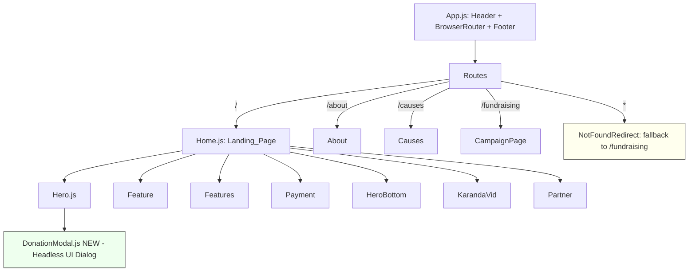

# Design Document

## Overview

This design covers two related changes to the Friends of Karanda Mission Hospital (FOKMH) React application:

1. **Remove the auto-launching Campaign_Popup** (Land Cruiser) from the Landing_Page so visitors are no longer interrupted on arrival.
2. **Modernize the Landing_Page** — improving layout, spacing, typography, visual hierarchy, responsiveness, accessibility, and interaction quality across its Section_Components — while preserving the existing Color_Palette and every donation destination and campaign link.

The work is intentionally scoped to presentation and interaction quality. No donation URLs, campaign routes, or backend behavior change. The application is a Create React App (CRA) project using React 18, Tailwind (via `@material-tailwind/react`), `framer-motion` for animation, and `react-router-dom` v6 for routing.

### Key constraints discovered during research

- **`bg-gradient-primary` / `bg-gradient-secondary` are undefined.** `Home.js` applies these classes, but they are not declared in `tailwind.config.js`, and `App.css` is empty. They currently have **no visual effect**. The redesign must either define them within the Color_Palette or replace them. This design replaces them with palette-derived utilities (see Data Models → Palette Tokens).
- **Teal `#3ea498` is used as an inline arbitrary value** (`bg-[#3ea498]`, `text-[#3ea498]`) in many components, and two different "teal-dark" hover shades exist (`#2d8276` in `Hero.js`, `#2c7b72` in `Feature.js`). The design standardizes these into named theme tokens.
- **`@headlessui/react` (v2.1.1) is already a dependency.** Its `Dialog` primitive provides focus trapping, Escape-to-close, focus return, scroll locking, and correct ARIA roles out of the box. This is the foundation for the accessible Donation_Modal, avoiding a hand-rolled implementation.
- **The `fundraising` route is registered as `path="fundraising"`** (no leading slash) in `App.js`, while the Hero links to `href="/fundraising"`. There is **no catch-all route**, so an unavailable destination currently renders a blank page. The design adds a fallback route and normalizes the path.
- **The Hero uses plain `<a href>` anchors** for internal navigation, causing full-page reloads. The design migrates internal links to react-router navigation for SPA behavior and to enable the fallback.

## Architecture

### Component hierarchy (after redesign)



`CampaignPopup` is **removed from the `Home` render tree** and its import deleted. The component file is retained in the codebase (unreferenced) so a future Visitor-initiated trigger can reuse it (Requirement 1.5), but it is dead code from the Landing_Page's perspective.

### Changes at a glance

| Area | Current | After |
|------|---------|-------|
| Auto popup | `<CampaignPopup />` rendered first in `Home` | Removed; import deleted |
| Donation modal | Inline JSX in `Hero.js`, no a11y affordances | Extracted `DonationModal` built on Headless UI `Dialog` |
| Palette | Inline `#3ea498`, undefined gradients | Named Tailwind theme tokens + defined gradient utility |
| Internal nav | `<a href>` full reload | react-router `Link` / `useNavigate` |
| Missing routes | Blank page | Catch-all fallback to `/fundraising` with message |
| Section spacing | Ad hoc per component | Standardized vertical rhythm tokens |

### Rendering & animation approach

The existing `framer-motion` scroll-reveal pattern (`whileInView` with `viewport={{ once: true }}`) is preserved because it already produces the desired progressive reveal. The redesign refines the *visual* layer (spacing, type scale, color tokens, focus styles) rather than replacing the animation architecture. Animations must respect `prefers-reduced-motion`; a reduced-motion variant disables translate/opacity transitions.

## Components and Interfaces

### 1. `Home.js` (Landing_Page) — modified

Responsibilities:
- Render Section_Components in the fixed order: Hero, Feature, Features, Payment, HeroBottom, KarandaVid, Partner (Requirement 1.2).
- No longer import or render `CampaignPopup` (Requirements 1.1, 1.4).
- Provide the standardized page background and inter-section vertical rhythm (Requirement 4.2).

Interface (props): none (route element).

Notable edits:
- Remove `import CampaignPopup` and its `<CampaignPopup />` usage.
- Replace `bg-gradient-primary` on the root with a neutral page background (`bg-white`, permitted neutral) and replace the `bg-gradient-secondary` accent on the Payment wrapper with the defined `bg-brand-gradient` palette utility (teal → cyan-600) or remove it if the section renders no content (Payment is currently empty).
- Apply a shared spacing wrapper so adjacent sections have ≥32px gap on mobile and ≥48px on desktop with no overlap.

### 2. `Hero.js` (Hero_Section) — modified

Responsibilities & preserved content (Requirements 4.1, 4.4, 7.1–7.3):
- Random background image from the existing list, with a **dark overlay meeting contrast requirements** (Requirements 3.4, 6.2, 6.8).
- Campaign banner linking to the fundraising page (accessible name identifies the campaign, Requirement 7.1).
- Primary headline "Friends of Karanda Mission Hospital" rendered at the **largest text size in the section** (Requirement 4.1, 4.4).
- Patient-sponsorship subtext plus the "Adopt a Patient" link to `/causes` (Requirements 4.4, 7.3), both above the fold.
- Primary "Donate Now" CTA (teal `#3ea498`) that opens the `DonationModal` (Requirements 2.1, 3.1), fully visible in the initial viewport (Requirement 4.1).
- "More Information" link to `/about` (Requirement 7.2).
- Scroll indicator.

Interface additions:
- Holds `const [isDonationOpen, setIsDonationOpen] = useState(false)`.
- Holds a ref to the Donate button (`donateButtonRef`) passed to `DonationModal` so focus returns to it on close (Requirements 2.5, 6.6). (Headless UI `Dialog` returns focus to the previously focused element automatically; the ref is used as an explicit `initialFocus`/return safeguard.)
- Renders `<DonationModal open={isDonationOpen} onClose={() => setIsDonationOpen(false)} returnFocusRef={donateButtonRef} />`.

Modernization edits:
- Reduce over-large arbitrary margins (e.g., `mt-60` on the banner) that push content around unpredictably; use responsive spacing tokens so the headline, subtext, Adopt-a-Patient link, and Donate CTA are all above the fold at 320px+ (Requirements 4.1, 4.4, 5.1).
- Convert internal `<a href="/...">` to react-router `Link` for SPA navigation (Requirements 7.2–7.4).
- Ensure every CTA has a visible focus ring (`focus-visible:ring-2 ring-offset-2`) with ≥3:1 contrast (Requirement 6.3) and a ≥44×44px touch target on mobile (Requirement 5.4).
- Set the overlay opacity so overlaid text reaches ≥4.5:1 (normal) / ≥3:1 (large) — see Error Handling / contrast note.

### 3. `DonationModal.js` — NEW component

A dedicated, accessible dialog extracted from the inline Hero modal, built on Headless UI `Dialog` (+ `framer-motion` for enter/leave animation).

Interface:

```js
/**
 * @param {boolean}  open           Whether the modal is visible.
 * @param {() => void} onClose      Called on close (backdrop click, Escape, close/Maybe-Later buttons).
 * @param {React.Ref} returnFocusRef Element to receive focus when the modal closes.
 */
function DonationModal({ open, onClose, returnFocusRef }) { /* ... */ }
```

Behavior:
- Presents **exactly three** regional Donation options: USA, Canada, Rest-of-World (Requirement 2.2), each activatable without scrolling at ≥320px (single-column stack on narrow viewports).
- On selection, opens the corresponding Donation_Link in a **new tab** while the Landing_Page tab stays open (Requirement 2.3). Uses programmatic `window.open(url, "_blank", "noopener,noreferrer")` so the return value can be inspected for popup-block detection (Requirement 2.6). Falls back to a normal `<a target="_blank" rel="noreferrer">` semantics for keyboard/pointer parity.
- **Popup-blocked handling:** if `window.open` returns `null` or a window whose `closed` is immediately `true`, the modal stays open and shows an inline, non-blocking message ("We couldn't open the donation page — please allow pop-ups, or use this link:") with the direct link (Requirement 2.6).
- Focus trap, Escape-to-close, focus return, and scroll lock are provided by Headless UI `Dialog` (Requirements 6.5, 6.6, 2.5). Close controls (the ✕ button and "Maybe Later") call `onClose`.
- Keyboard Enter/Space activate options identically to pointer (native `<a>`/`<button>` semantics) (Requirement 6.4).
- ARIA: `Dialog` supplies `role="dialog"`, `aria-modal="true"`; the header title is wired via `Dialog.Title` for the accessible name.

Donation_Links (must match character-for-character — Requirement 2.4):

| Region | URL |
|--------|-----|
| USA | `https://give.team.org/give/672997/#!/donation/checkout` |
| Canada | `https://give.ca.team.org/give/673060/#!/donation/checkout` |
| Rest of World | `https://magetsi.co.zw/billers/friends-of-karanda-mission-hospital` |

### 4. `App.js` — modified (routing fallback)

- Normalize `path="fundraising"` to `path="/fundraising"`.
- Add a catch-all route `<Route path="*" element={<NotFoundRedirect />} />`.

`NotFoundRedirect` (new small component): navigates to `/fundraising` and surfaces a message that the requested destination was unavailable (Requirement 7.5). It can use `useNavigate` with a state flag consumed by the campaign page, or render a brief interstitial with the message before redirecting.

### 5. `tailwind.config.js` — modified (palette standardization)

Add named brand tokens and a gradient utility derived solely from palette colors (see Data Models). This lets components reference `bg-brand-teal` / `text-brand-teal` instead of the arbitrary `#3ea498`, and replaces the undefined gradient utilities.

### 6. Section_Components (Feature, Features, Payment, HeroBottom, KarandaVid, Partner) — refined

No structural rewrite. Apply the shared design tokens:
- Swap inline `#3ea498` / `#2d8276` / `#2c7b72` for the standardized `brand-teal` / `brand-teal-dark` tokens (Requirements 3.1, 3.3).
- Ensure headings ≥1.5× body size, heading weight ≥600, body weight ≤400 (Requirement 4.3).
- Single-column at mobile, multi-column where designated at ≥768px, images `max-w-full` so nothing exceeds viewport width (Requirements 5.1, 5.2, 5.5).
- Add `alt` text to informative images and `alt=""` to decorative images (Requirements 6.1, 6.7).

## Data Models

These are configuration/constant structures, not persisted data.

### Palette Tokens (in `tailwind.config.js`)

```js
theme: {
  extend: {
    colors: {
      brand: {
        teal: "#3ea498",       // primary CTA / accent (Req 3.1)
        "teal-dark": "#2d8276" // single canonical hover shade (replaces #2c7b72)
      }
      // cyan-600, orange-500, orange-600 come from Tailwind defaults (in-palette)
    },
    backgroundImage: {
      // Replaces undefined bg-gradient-primary/secondary; palette-only (teal -> cyan-600)
      "brand-gradient": "linear-gradient(to right, #3ea498, #0891b2)"
    }
  }
}
```

The **enumerated Color_Palette** (Requirement 3.3) is exactly: `brand-teal (#3ea498)`, `cyan-600`, `orange-500`, `orange-600`, and dark black-opacity overlays. Neutrals (white, black, grays) are permitted for text/background/borders per Requirement 3.5.

### DonationOption

```js
/** @typedef {{ region: "USA" | "Canada" | "RestOfWorld", label: string, url: string, colorClass: string }} DonationOption */
const DONATION_OPTIONS = [
  { region: "USA",         label: "🇺🇸 USA Donations",      url: "https://give.team.org/give/672997/#!/donation/checkout",              colorClass: "bg-brand-teal hover:bg-brand-teal-dark" },
  { region: "Canada",      label: "🇨🇦 Canada Donations",   url: "https://give.ca.team.org/give/673060/#!/donation/checkout",           colorClass: "bg-cyan-600 hover:bg-cyan-700" },
  { region: "RestOfWorld", label: "🌍 Rest of the World",  url: "https://magetsi.co.zw/billers/friends-of-karanda-mission-hospital",   colorClass: "bg-orange-600 hover:bg-orange-700" },
];
```

### HeroNavLink

```js
/** @typedef {{ label: string, to: string }} HeroNavLink */
const HERO_LINKS = {
  campaign:  { label: "Learn More",       to: "/fundraising" }, // Req 7.1
  moreInfo:  { label: "More Information",  to: "/about" },       // Req 7.2
  adopt:     { label: "Adopt a Patient",  to: "/causes" },      // Req 7.3
};
```

### Hero background images

The existing array of 6 external Squarespace URLs + local `kmhgate` is retained as-is (random selection on mount).

## Error Handling

| Scenario | Handling | Requirement |
|----------|----------|-------------|
| Popup/new tab blocked when selecting a donation option | Detect via `window.open` returning `null`; keep modal open and show inline message with a direct fallback link | 2.6 |
| Navigation to an unavailable route | Catch-all `*` route → `NotFoundRedirect` navigates to `/fundraising` and shows an "requested destination was unavailable" message | 7.5 |
| Hero background image (external Squarespace URL) fails to load | Overlay + solid neutral background remain, so text stays legible; optionally set a local fallback image (`kmhgate`) via `onError` | 3.4, 6.2 |
| Insufficient overlay contrast over a light background image | Fix overlay at `bg-black/60` (≈8.6:1 for white text at typical luminance) rather than `/50`, guaranteeing ≥4.5:1 normal / ≥3:1 large text regardless of the random image | 3.4, 6.2, 6.8 |
| Reduced-motion users | `prefers-reduced-motion` disables translate/opacity animations to avoid discomfort | 6 (usability) |
| Horizontal overflow on small screens | Root keeps `overflow-x-hidden`; media use `max-w-full`; layout is single-column below 768px | 5.1, 5.3, 5.5 |

## Testing Strategy

### Why not property-based testing

The workflow requires assessing PBT applicability before writing properties. This feature is a **UI redesign plus a component-removal and an accessibility refactor**. Its acceptance criteria fall into categories the guidance explicitly excludes from PBT:

- **UI rendering / layout / typography / spacing** (Reqs 4.x, 5.x) → snapshot and example-based render assertions.
- **Color application and contrast** (Reqs 3.x, 6.2, 6.8) → the palette is a fixed enumerated set and contrast is checked against fixed color pairs; these are example/static checks, not generated-input properties.
- **Fixed navigation destinations and donation URLs** (Reqs 2.4, 7.1–7.3) → constant/example assertions.
- **Keyboard, focus-trap, Escape, focus-return interactions** (Reqs 2.5, 6.3–6.6) → component interaction tests with Testing Library.
- **Component absence and side-effect behavior** (Reqs 1.x, 2.6) → example-based render/interaction tests.

There is no pure function with a meaningful "for all inputs X, P(X) holds" statement, so PBT would add cost without finding additional bugs. Accordingly, no property-based tests and no property-based testing library are introduced.

### Test tooling

The project already ships CRA's Jest + React Testing Library (`@testing-library/react`, `@testing-library/jest-dom`, `@testing-library/user-event`). These cover the needs. Two low-friction additions are recommended:

- `jest-axe` for automated accessibility assertions on rendered components (contrast rules still require manual/tool verification — see note).
- Continue using `user-event` for keyboard interaction (Tab, Enter, Space, Escape).

The existing placeholder `App.test.js` (CRA "learn react link") is obsolete and will be replaced, since the app no longer renders that link.

### Unit & component tests (example-based)

Popup removal (Req 1):
- Rendering `Home` does **not** render Campaign_Popup content (assert the Land-Cruiser modal text/role is absent immediately and after a ≥5s fake-timer advance) (Reqs 1.1, 1.3).
- `Home` renders all seven Section_Components in order (Req 1.2).
- Static check / lint assertion that `Home.js` no longer imports `CampaignPopup` (Req 1.4).

Donation modal (Req 2, 6):
- Activating the Donate CTA opens the modal (Reqs 2.1, 3.1).
- Modal shows exactly three options with the exact Donation_Links (character-for-character assertion against the constant table) (Reqs 2.2, 2.4).
- Selecting an option calls `window.open` with the correct URL and `_blank`; modal remains open (Req 2.3). Mock `window.open`.
- When `window.open` returns `null`, the modal stays open and shows the blocked-popup message (Req 2.6).
- Escape closes the modal and focus returns to the Donate button (Reqs 6.6, 2.5).
- Tab cycling stays within the modal (focus trap) (Req 6.5).
- Enter and Space activate CTAs identically to click (Req 6.4).
- Close (✕ / Maybe Later) returns focus to the opener (Req 2.5).

Hero content & navigation (Reqs 4, 7):
- Headline "Friends of Karanda Mission Hospital", patient-sponsorship text, and "Adopt a Patient" link are present (Reqs 4.4).
- Hero exposes links with accessible names: campaign link → `/fundraising`, "More Information" → `/about`, "Adopt a Patient" → `/causes` (Reqs 7.1–7.3).
- Unknown route renders the fallback and lands on `/fundraising` with the unavailable message (Req 7.5). Test with `MemoryRouter` at a bogus path.

Palette (Req 3):
- Primary CTAs carry the `brand-teal` token class (Req 3.1).
- Assert no component references teal shades other than the two canonical tokens (grep/static assertion for stray `#2c7b72`) (Reqs 3.3, 3.5).

### Snapshot / responsive tests

- Snapshot tests for Hero and DonationModal to catch unintended layout/markup regressions.
- Responsive behavior (single-column <768px, multi-column ≥768px, no horizontal scroll, ≥44px touch targets, media ≤ viewport width) is primarily verified through class-based assertions (presence of responsive utility classes and min-size classes) plus **manual verification** at 320px, 375px, 768px, 1280px, and 3840px, since jsdom does not compute real layout (Reqs 5.1–5.5, 4.1, 4.2).

### Accessibility tests

- `jest-axe` run on Hero and DonationModal for role/name/alt violations (Reqs 6.1, 6.7).
- Focus-indicator visibility (Req 6.3), and contrast ratios (Reqs 3.4, 6.2, 6.8) require **manual/tooling verification** (e.g., browser DevTools or an axe browser extension) because contrast is not reliably computed in jsdom. This limitation is called out explicitly: automated tests assert the *fixed overlay opacity and token classes*; the actual ratio is confirmed manually against the chosen colors.

### Manual verification checklist (limitations of automated testing)

Because jsdom does not render real pixels, the following are verified manually and noted as such:
- Above-the-fold visibility of headline + Donate CTA at 320px+ (Reqs 4.1, 4.4).
- Inter-section spacing thresholds (≥32px mobile / ≥48px desktop) and no overlap (Req 4.2).
- Reflow within 200ms on resize and no horizontal scroll across 320–3840px (Reqs 5.3).
- Contrast ratios for overlaid and body text (Reqs 3.4, 6.2, 6.8).
